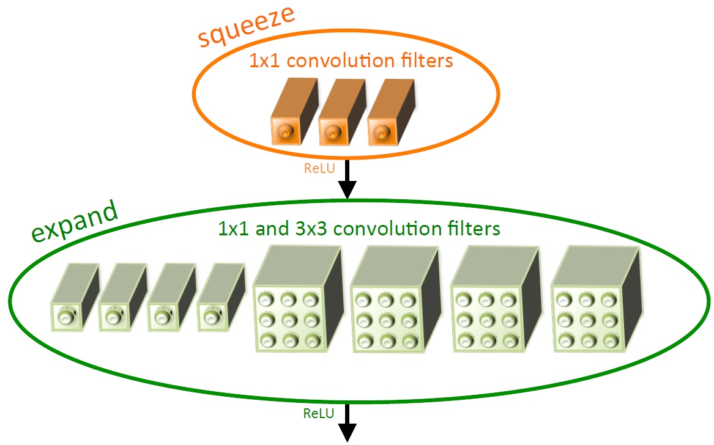

## SqueezeNet, SqueezeNetv2, SqueezeNetv3 Implementation
This repository is about SqueezeNet, SqueezeNetv2, SqueezeNetv3 in Tensorflow 2.  
I used tf.keras.Model and tf.layers.Layer instead of tf.keras.models.Sequential.  
This allows us to customize and have full control of the model.  
I also used custom training instead of relying on the fit() function.  
In case we have very huge dataset, I applied online loading (by batch) instead of loading the data completely at the beginning. This will eventually not consume the memory.  


#### The Fireblock

<center>

</center>   


#### The Architectures of SqueezeNet,SqueezeNetv2 and SqueezeNetv3
<center>   
   
</center>


#### The paremeters of SqueezeNet

<center>

</center>

Images are taken from [source](https://arxiv.org/pdf/1602.07360.pdf)   

### Requirement
```
python==3.7.0
numpy==1.18.1
```
### How to use
Training & Prediction can be run as follows:    
`python train.py train`  
`python train.py predict img.png`  


### More information
* Please refer to the original paper of SqueezeNet [here](https://arxiv.org/pdf/1602.07360.pdf) for more information.

### Implementation Notes
* **Note 1**:   
Since datasets are somehow huge and painfully slow in training ,I decided to make number of filters variable. If you want to run it in your PC, you can reduce the number of filters into 8,4 or 2. (16 is by default). For example:  
`model = squeezenet.SqueezeNet((None, height, width, channel),  classes = n_outputs, , filters = 8)`

* **Note 2** :   
You can also make the size of images smaller, so that it can be ran faster and doesn't take too much memories.

### Result for MNIST:
* width      = 224 >> 2
* height     = 224 >> 2   
* Learning rate = 0.0001  
* Batch size = 32  
* Optimizer = Adam   
* Filters = 16
* epochs = 2

Name |  Training Accuracy |  Validation Accuracy  |
:---: | :---: | :---:
SqueezeNet | 87.92% | 96.01%
SqueezeNetv2 | 92.86% | 97.51%
SqueezeNetv3 | 93.4% | 97.7%
